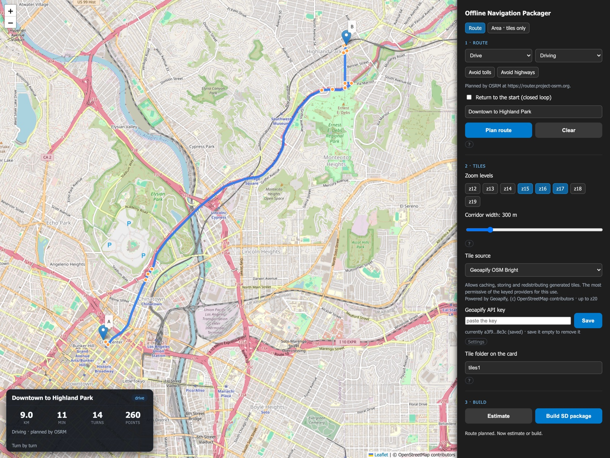
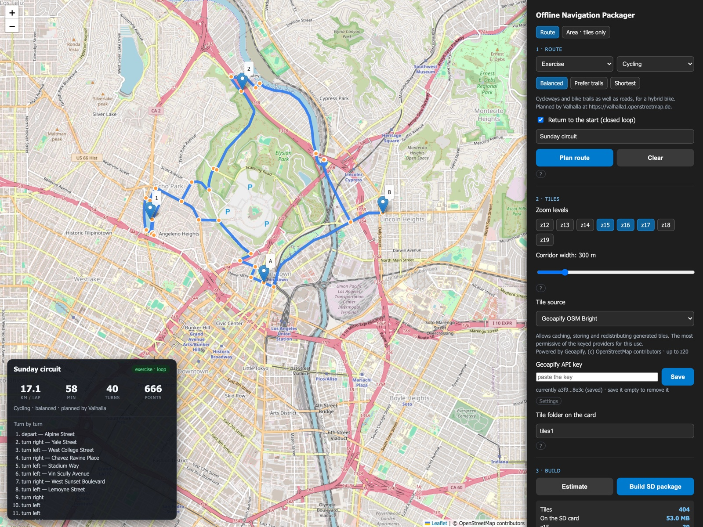
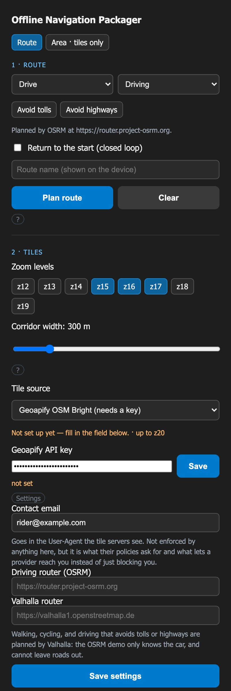

# Offline Map Downloader

**Two separate Flask apps in one repository.** Both put map tiles on your own
storage for offline use; they differ in what you point them at. Neither one
touches the other &mdash; run either, or both at once, on different ports.

| | **v1** &mdash; `app.py` | **v2** &mdash; `app_nav.py` |
|---|---|---|
| You select | a rectangle on the map | a route through the points you click, or a rectangle with no route |
| It downloads | every tile in the box | a corridor around the route, or every tile in the rectangle |
| You get | `tiles.zip` or `tiles.mbtiles` | a ready-to-unzip SD card, tiles already in RGB565 |
| Turn instructions | &mdash; | `route.bin` with geometry, per-zoom detail and turns |
| Tile format | PNG, convert them yourself afterwards | LVGL v9 RGB565 `.bin`, converted in memory |
| Tile sources | public OpenStreetMap and ArcGIS | only sources whose terms permit offline use; API key entered in the page |
| Runs on | `http://127.0.0.1:5000` | `http://127.0.0.1:5001` |
| Made for | any offline map viewer | [map_tiles](https://github.com/0015/map_tiles) **v2.0.0** navigation on ESP32 |
| Documented in | [this file, below](#-v1--offline-map-downloader-apppy) | [this file, below](#-v2--offline-navigation-packager-app_navpy) and [README_NAV.md](./README_NAV.md) |

**Which do you want?** For a patch of map to pan around on a v1 project, that
is **v1**, and it is unchanged. For the v2 firmware, that is **v2**: a route
with turn instructions, or a patch of map with no route at all, either way on an
SD card the device reads as it is.

### Which files belong to which

No Python module is shared between the two apps, so a change to one cannot break
the other.

| | v1 | v2 |
|---|---|---|
| App | `app.py` | `app_nav.py` |
| Page | `templates/index.html` | `templates/nav_index.html` |
| Requirements | `requirements.txt` | `requirements_nav.txt` (adds `Pillow`) |
| README | `README.md` (the v1 half, below) | `README_NAV.md` |
| Also imports | &mdash; | `tile_sources.py`, `settings.py`, `route_format.py` |
| Tile cache | `tiles/<style>/` | `tiles_v2/<source>/` |
| Settings | none | `~/.config/offline-map-downloader/settings.json` |

`app.py` imports nothing from `app_nav.py` and vice versa. The two only share
`static/` (favicon and stylesheet), `LICENSE` and this README.

---

# 🧭 v2 &mdash; Offline Navigation Packager (`app_nav.py`)

<div align="center">

[](./README_NAV.md)
<p><b>v2</b> &mdash; plan a route, get an SD card</p>

</div>

> This section is v2. The full v2 manual is
> [README_NAV.md](./README_NAV.md); what follows is the tour.
> For the original rectangle downloader, jump to
> [v1](#-v1--offline-map-downloader-apppy).

## Why v2 exists

The v1 rectangle is the right shape for a map you pan around by hand, and the
wrong one for navigation. Building a route onto a device ran into four walls,
and none of them could be fixed by choosing a better rectangle.

**A route's bounding box is mostly tiles you will never see.** A 20 km drive
across a city needs the streets along it, not the square it happens to sit in.
Worked out for one running diagonally at z15&ndash;17: **about 850 tiles** for a
300 m corridor, against about 4,300 for its bounding box &mdash; and the box
grows with the square of the distance.

**Tiles alone are not navigation.** The device also needs the line to follow and
the turns along it. That meant exporting a GPX somewhere else, and still having
nothing to say at a junction.

**The tiles needed converting afterwards.** v1 hands you PNGs; the device reads
RGB565 with a 12-byte header, so every build ended with a separate pass of
`lvgl_map_tile_converter.py` over the whole folder.

**And the public OpenStreetMap servers stop you.** Their usage policy forbids
bulk downloading and the servers enforce it — past the limit you stop receiving
tiles and start receiving an *"Access Blocked — App is not following the tile
usage policy"* picture, with HTTP 200, which lands on the card looking like any
other tile. You find out on the device.

## ✨ What v2 does

### Plans the route, and packages what it needs

Click waypoints, plan, build. Out comes one zip you unpack onto the card:

```
navigation_sdcard.zip
├── tiles1/<zoom>/<x>/<y>.bin     RGB565, converted in memory
├── routes/my-route.bin           geometry, per-zoom detail, turn instructions
├── routes/my-route.txt           what this build contained
└── README.txt                    how to merge more routes onto the card
```

Every point you click is a via point, so the route goes **the way you drew it**
rather than the way the router would have preferred.

### Or just the map

Switch to **Area · tiles only**, draw a rectangle, build: the same
ready-to-unzip card with no route in it. The v2 firmware opens it as a map on
its own, with your position on it and nothing to follow.

### Knows the difference between getting somewhere and going for a ride

<div align="center">

[](./README_NAV.md)
<p>A closed cycling circuit: <b>17.1 km per lap</b>, 40 turns, and the estimate before you commit</p>

</div>

Tick **Return to the start** and the route closes. The route file records that,
and the device laps it instead of arriving. Pick **Exercise** as well and the
panel counts elapsed time and distance instead of counting down what is left.

### Takes its keys in the browser

<div align="center">

</div>

Pick a tile source and, if it needs a key, the field appears underneath. Saving
takes effect immediately — no restart, no re-exporting in every new shell. Keys
live in `~/.config/offline-map-downloader/settings.json`, outside the repository
so one cannot be committed by accident, and are only ever sent back to the page
masked.

### Uses tile sources that allow this

v2 will not build a card from the public OpenStreetMap servers. It offers the
ones that permit offline use instead, and shows what each one's terms actually
say — they differ a great deal, and two of the best-known names say no on their
standard plans. **Geoapify** has a free tier that allows it; self-hosting has no
quota at all.

It also watches what comes back: if the same bytes keep arriving for different
coordinates, that is an error picture rather than a map, and the build stops
rather than writing several hundred copies of it to your card. (A plain
one-colour tile, like open sea, is allowed to repeat.)

### Does not ask twice

Tiles are cached per source, and so are the absences. Rebuilding the same route
costs **zero** requests — measured on an 82-tile corridor: 82 cold, 0 on every
rebuild after.

### Fills one card with many routes

Unzip as many builds as you like onto the same card. Each route records the tile
folder it belongs to, so routes over the same ground share those tiles instead of
carrying a copy each, and a route in another region gets its own folder.

```
/tiles_oc/...      /routes/sna-to-home.bin, /routes/sunday-circuit.bin
/tiles_tahoe/...   /routes/holiday.bin
```

## 🚀 Running v2

```bash
pip install -r requirements_nav.txt
python app_nav.py
```

👉 [http://127.0.0.1:5001](http://127.0.0.1:5001) — then set a tile source in the page.

Already have a GPX? `python route_format.py --gpx ride.gpx --out route.bin`

📖 **[README_NAV.md](./README_NAV.md)** has the rest: which tile sources permit
what, self-hosting, the `route.bin` format, how laps are counted, and how to put
several routes on one card.

### And on the device

The card v2 builds is read by
[**map_tiles v2.0.0**](https://github.com/0015/map_tiles) or later — the release
that added the navigation layer. Firmware that navigates from it, on a round
AMOLED, is in
[**map_tiles_projects/v2**](https://github.com/0015/map_tiles_projects/tree/main/v2).
A v1 card built with `app.py` still works with the v1 projects, once its PNGs
have been through `lvgl_map_tile_converter.py`.

---

# 📦 v1 &mdash; Offline Map Downloader (`app.py`)

<div align="center">

[](https://youtu.be/uJirSqlyhA4)
<p>Simple Python-Flask App</p>
</div>

> **From here on the page is v1**, apart from the Dependencies and Attribution
> sections at the end, which cover both. v1 itself is unchanged from before v2
> existed. For routes and navigation, go back to
> [v2](#-v2--offline-navigation-packager-app_navpy) or read
> [README_NAV.md](./README_NAV.md).

This is a Flask web application that allows you to **select a geographic area on a map** and download OpenStreetMap or Satellite tiles as a `.zip` or `.mbtiles` file for offline use.

---

## ⚠️ Important Notice (v1)

v1 is intended for **personal, educational, or experimental use only**.

It does **not use any API keys or authenticated tile services**, and fetches tiles directly from public endpoints like OpenStreetMap and ArcGIS. As such:

> **Do not use this tool for commercial applications or large-scale automated downloads.**  
> Please respect the tile providers' usage policies.

This is one of the reasons v2 exists: it refuses to build a card from the public
OpenStreetMap servers and offers sources whose terms allow offline use instead. See
[Uses tile sources that allow this](#uses-tile-sources-that-allow-this).

---

## 🔧 Features (v1)

- 📍 Select area with a rectangle on the map  
- 🔍 Choose zoom level range (10–19)  
- 🌐 Switch between OpenStreetMap and Satellite view  
- 🧮 Preview tile count before download  
- 🎨 Live preview of selected area using actual map tiles  
- 💾 Export to `.zip` or `.mbtiles`  

---

## 🚀 Getting Started with v1

### 1. Clone the Repository

```bash
git clone https://github.com/0015/OfflineMapDownloader.git
cd OfflineMapDownloader
```

### 2. Create & Activate Virtual Environment

```bash
python3 -m venv .venv
source .venv/bin/activate  # macOS/Linux
# OR
.venv\Scripts\activate     # Windows
```

### 3. Install Dependencies

```bash
pip install -r requirements.txt
```

### 4. Run the App

```bash
python app.py
```

Then open your browser and go to:  
👉 [http://127.0.0.1:5000](http://127.0.0.1:5000)

(v2 is `python app_nav.py` on port **5001**, so the two can run side by side.)

---

## 📁 Output Formats (v1)

- `tiles.zip` – folder structure with PNG tiles by zoom/x/y  
- `tiles.mbtiles` – SQLite-based format (flat database file)  

---

## 🛠 Dependencies

| | v1 &mdash; [`requirements.txt`](./requirements.txt) | v2 &mdash; [`requirements_nav.txt`](./requirements_nav.txt) |
|---|---|---|
| `Flask` | ✅ | ✅ |
| `requests` | ✅ | ✅ |
| `Pillow` | &mdash; | ✅ (RGB565 conversion in memory) |

Install one or the other, or both into the same virtual environment.

---

## 📝 License

MIT License  
(c) 2025 Eric Nam / ThatProject

---

## 🌐 Attribution

**v1** map tiles provided by:
- [OpenStreetMap](https://www.openstreetmap.org)
- [Esri Satellite Imagery](https://www.arcgis.com/home/item.html?id=10df2279f9684e4a9f6a7f08febac2a9)

**v2** does not download from those endpoints; its page only shows an
OpenStreetMap map to click on, which is ordinary browsing. It lists the
attribution its chosen tile source requires and writes it onto the card
alongside the tiles &mdash; see
[Where the tiles come from](./README_NAV.md#where-the-tiles-come-from).
Routing in v2 is by [OSRM](http://project-osrm.org/) for driving, and by
[Valhalla](https://github.com/valhalla/valhalla) for walking, cycling and
driving that avoids tolls or highways.

---

## 🙌 Credits & Reference

This project was inspired by [AliFlux/MapTilesDownloader](https://github.com/AliFlux/MapTilesDownloader)  
Special thanks to their work on simplifying tile downloading logic.

Created by [@ThatProject](https://github.com/0015)
